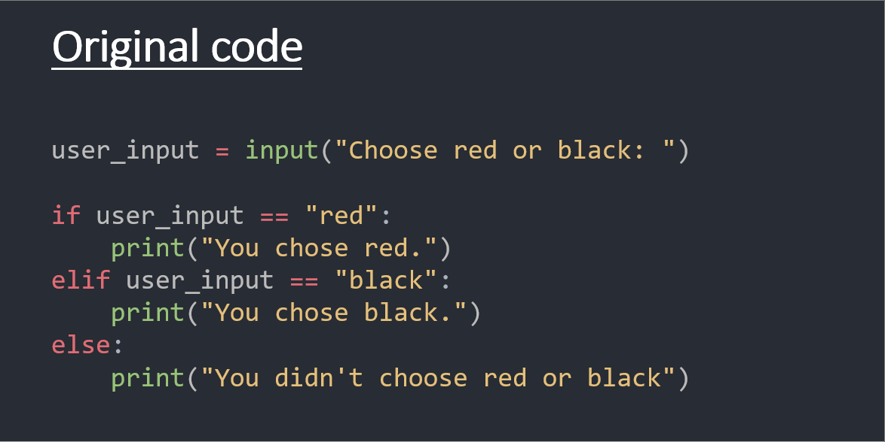

# Step 4

## Introduction

So far we have displayed a menu to the user, asked them to enter their selection, and then told the user what they entered. The application then ends.

Ideally, we would like it so that the user is returned back to the menu afterward.

To do this, we can put all of our code into an infinite loop. That way, when the end of your code is reached, it goes back to the start.

## Objective(s)

- Create an infinite loop using a while statement

## Background Information

### while

In Python, the `while` loop is used to repeatedly perform a task (or tasks) as long as (while) a certain condition is true.

A little trick we can use is to simply set the condition to **1**, for example: `while 1`. This might seem odd at first. The reason we do this is because ***1*** is a fixed number and does not change, therefore the code loops indefinitely until manually interrupted using a `break` statement.

For example:

```
while 1:
 user_input = input("Enter your name: ")
    
 if user_input == 'Kim':
 break

 print("Now we go back to the start.")
```

In this example, the `while` loop will keep running until it is stopped. The user can stop the loop by entering 'Kim', which triggers the `break` statement (which exits the loop).

**Visual demonstration:**



## Steps

1. Edit your zoo-manager.py file.
2. Create an infinite loop using a `while 1:` statement at the top of your code.
3. Indent all other lines of your code (1 level) to add them to the loop.
4. Save and run your program. Does it work correctly? Does it return to the menu after making a selection?

## More Information

- [W3Schools: Python While Loops](https://www.w3schools.com/python/python_while_loops.asp)

